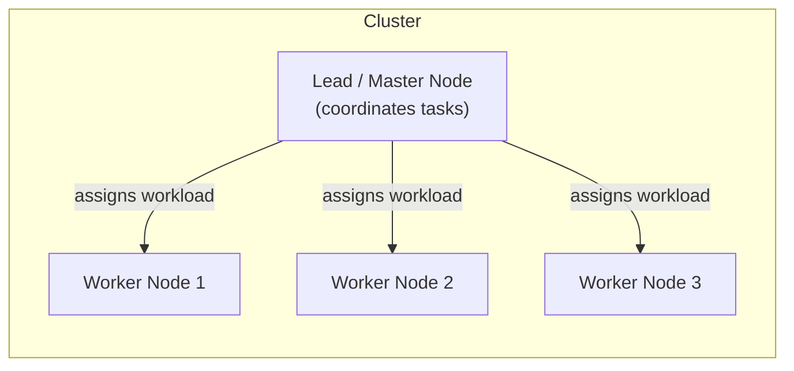
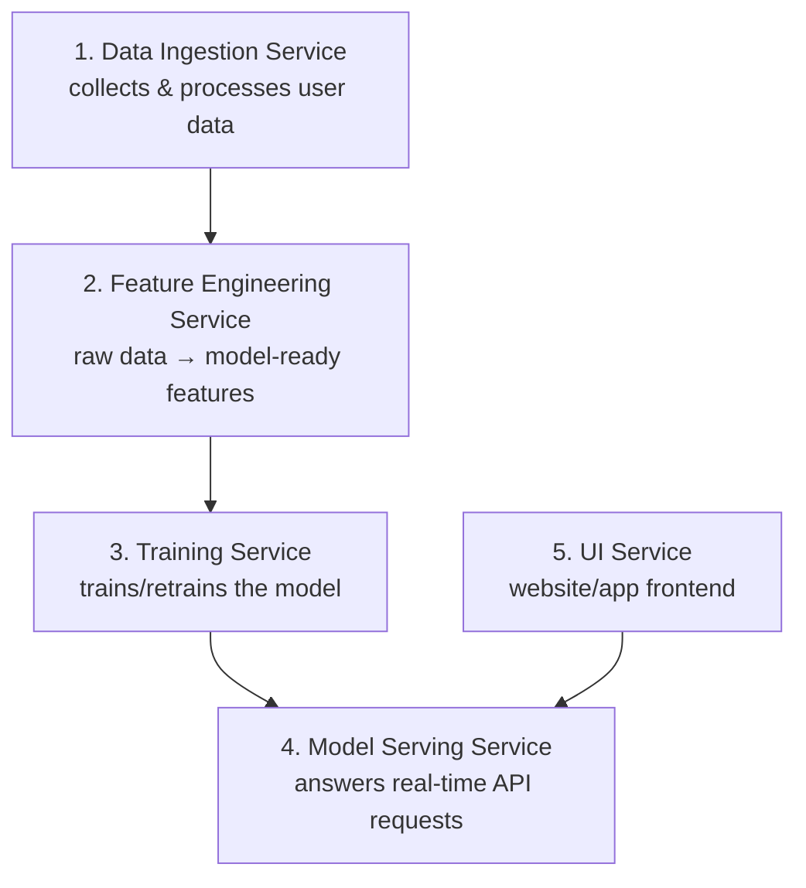
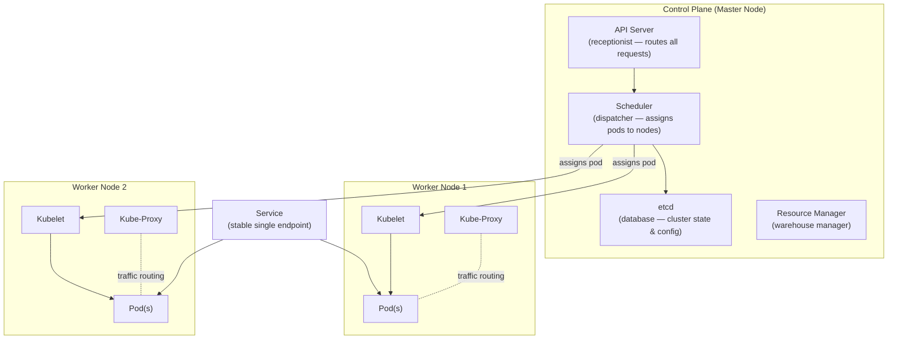
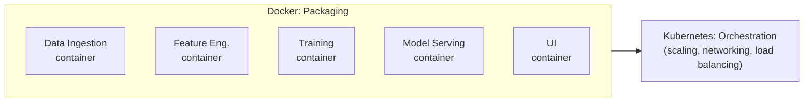
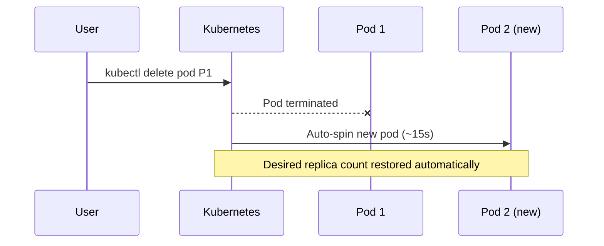

# **Kubernetes for MLOps: A Beginner-Friendly Guide**  

Welcome to the **Kubernetes for MLOps** tutorial! This repository contains detailed notes, practical examples, and code to help you master Kubernetes fundamentals, distributed computing, microservices, and their applications in the world of Machine Learning Operations (MLOps).  

---

## **What You'll Learn**  

In this tutorial, we’ll cover:  
1. **Distributed Computing Fundamentals**  
   - Clusters, Lead Nodes, Communication, and Concurrency.  
   - Comparison with frameworks like Apache Spark.  

2. **Kubernetes Internals**  
   - Master Node and Worker Node Architecture.  
   - Key components like API Server, etcd, kubelet, and kube-proxy.  

3. **Microservices for MLOps**  
   - Microservices explained with a real-world Machine Learning scenario.  
   - How Docker and Kubernetes revolutionize microservices deployment for ML workflows.   

---


<details><summary>FAst notes of kuber</summary>
# ☸️ Distributed Computing & Kubernetes — Notes

> Personal study notes on distributed computing fundamentals, microservices architecture, and a hands-on Kubernetes/Minikube implementation walkthrough.

[](https://kubernetes.io/)
[](https://www.docker.com/)
[](#)

## 📑 Table of Contents

- [1. Distributed Computing — The Basics](#1-distributed-computing--the-basics)
- [2. Microservices — The Real-World Scenario](#2-microservices--the-real-world-scenario)
- [3. How Kubernetes Solves Distributed Computing's Challenges](#3-how-kubernetes-solves-distributed-computings-challenges)
- [4. Kubernetes Internals](#4-kubernetes-internals)
- [5. Docker + Kubernetes + Microservices](#5-docker--kubernetes--microservices--how-they-connect)
- [6. Practical, Hands-On Implementation Notes](#6-practical-hands-on-implementation-notes)
- [7. Quick-Reference Summary](#7-quick-reference-summary)

---

## 1. Distributed Computing — The Basics

**Distributed Computing** = a system where multiple computers (nodes) work together to solve a large problem or process data collaboratively. Tasks are divided among nodes, enabling parallel processing for faster, more efficient computation.



### Core Components

| Component | What it does |
|---|---|
| **Cluster** | A group of interconnected computers (nodes) that work as one system, sharing workload, redundancy, and performance. |
| **Lead-Node (Master)** | Manages the cluster — assigns workloads, monitors node health, keeps things running smoothly. |
| **Communication** | Nodes exchange data/instructions via network protocols — critical for synchronization and task distribution. |
| **Concurrency** | Multiple tasks run simultaneously across nodes → speed + fault tolerance (if one node fails, others absorb the load). |
| **Spark vs Kubernetes** | Spark uses **MapReduce** (map = process, reduce = aggregate) — a specific computation model. Kubernetes is general-purpose: it orchestrates containers without imposing a computation model. |

### Benefits

- 🔹 **Scalability** — spread work across many machines (e.g., a 10-hour ML training job runs much faster across 10 machines).
- 🔹 **Fault Tolerance** — like a power grid: if one station goes down, others take over.
- 🔹 **Improved Performance** — parallel processing = lower latency, more concurrent users served.
- 🔹 **Cost Efficiency** — many cheap machines instead of one expensive one.
- 🔹 **Flexibility** — mix hardware types, vendors, and cloud providers freely.

### Challenges

- ⚠️ **Resource Management** — avoiding overloaded vs. idle machines.
- ⚠️ **Scaling** — adding/removing machines smoothly during traffic spikes.
- ⚠️ **Communication & Networking** — latency, failures, misconfiguration.
- ⚠️ **Fault Handling** — detect failures, recover data, reroute tasks with minimal downtime.
- ⚠️ **Load Balancing** — spreading tasks evenly.
- ⚠️ **Configuration & Deployment** — manually configuring hundreds of machines is a nightmare.
- ⚠️ **Monitoring & Debugging** — logs/metrics scattered across many machines.

---

## 2. Microservices — The Real-World Scenario

**Example:** A Netflix-style ML movie recommender.

**Monolithic approach:** all 5 components bundled into one app. If only *Model Serving* needs more resources, you're forced to scale the *entire* application.

**Microservices approach:** break it into independent, individually-scalable services.



> Only **Model Serving** needs to scale when user requests spike — the rest stay untouched.

### 🍔 Analogy: Food Court
Each stall (service) specializes in one cuisine and runs independently. If one runs out of ingredients or needs upgrades, the others are unaffected. The **food court manager = Kubernetes**, making sure every stall gets the resources (power, water) it needs.

---

## 3. How Kubernetes Solves Distributed Computing's Challenges

| Challenge | Kubernetes' Answer |
|---|---|
| Resource Management | Automatically schedules workloads based on available resources. |
| Scaling | Change a number in the deployment config → pods added/removed automatically. |
| Networking | Built-in networking lets pods talk to each other seamlessly. |
| Fault Handling | **Self-healing** — crashed pods are restarted/rescheduled automatically. |
| Load Balancing | Traffic spread evenly across all healthy pods. |
| Deployment | Declarative YAML manifests define desired state; K8s makes it happen. |
| Monitoring | Integrates with Prometheus, ELK Stack, etc. for a unified view. |

---

## 4. Kubernetes Internals



### Glossary (with analogies)

| Term | Role | Analogy |
|---|---|---|
| **Master Node (Control Plane)** | Brain of the cluster — oversees everything | Factory manager |
| **Resource Manager** | Allocates CPU/memory/storage efficiently | Warehouse manager |
| **API Server** | Entry point for all user requests | Office receptionist |
| **etcd** | Central database of cluster state | Library catalog |
| **Worker Node** | Runs the actual applications | Factory floor workers |
| **Kubelet** | Agent per node ensuring containers run correctly | Shift supervisor |
| **Kube-Proxy** | Manages network traffic to/from pods | Traffic cop |
| **Pod** | Smallest deployable unit (wraps 1+ containers) | Container ship |
| **Volumes (SharedDB)** | Shared storage between pods | Shared locker room |
| **Kube-Manifest (YAML)** | Config file describing desired state | House blueprint |
| **Service** | Stable network endpoint to reach a set of pods | Restaurant hotline number |
| **Namespace** | Virtual sub-cluster for organizing resources | Departments in an office building |
| **Scheduler** | Decides which node runs a new pod | Task dispatcher |
| **ReplicaSet** | Keeps a fixed number of identical pods running | Backup generator |

### Analogy: Without vs. With Kubernetes

- **Without K8s:** Running a restaurant chain manually — if a branch runs out of ingredients or a waiter quits, everything falls apart.
- **With K8s:** A central system monitors every branch live, restocks automatically, "hires" temp staff (spins up pods) when needed, and redirects customers to less crowded branches.

---

## 5. Docker + Kubernetes + Microservices — How They Connect



- **Docker** = packages each microservice into a portable "takeout box" containing all its dependencies — runs identically on laptop, server, or cloud.
- **Kubernetes** = the food court manager — scales the busy "stall" (adds pod replicas), handles networking between containers, and load-balances traffic.

### Advantages of Microservices + Docker + Kubernetes for ML
1. **Independent Scaling** — scale only what needs it (e.g., Model Serving) without touching Training.
2. **Resilience** — one service crashing doesn't take down the rest.
3. **Flexibility** — mix languages/tools per service (e.g., Python/TensorFlow for serving, JavaScript/React for UI).

---

## 6. Practical, Hands-On Implementation Notes

### 6.1 Hardware Reality Check
- Recording + running a local K8s cluster on **8GB RAM crashed** the demo machine — needed to upgrade to **24GB**.
- **Just practicing (not recording)? 8–12GB RAM is enough.**
- Used a **lightweight Flask app** ("poor man's app" — takes a name, says "Hello") instead of a real ML app, because ML Docker images (700MB–1.5GB) are too heavy for a local cluster. Learn the **K8s deployment flow** first, then swap in a heavier ML app later.

### 6.2 Dockerizing the App
- In the `Dockerfile`, set environment variables to stop Python from writing `.pyc` files — keeps the image lightweight (tip picked up from an LLM).
- Build command:
  ```bash
  docker build -t kubernetes-test-app:latest .
  ```
  → resulted in a tiny **~130MB** image.

### 6.3 Minikube Setup

> **Minikube = local K8s cluster for R&D/learning only.** Never used in real production.

**"Nasty" `minikube start` error — troubleshooting checklist:**
1. Confirm active internet connection (Minikube downloads components).
2. Check for proxy issues — pass proxy explicitly if needed:
   ```bash
   minikube start --docker-env HTTP_PROXY=<your_proxy>
   ```
3. If you don't use a proxy, clear any proxy env vars from PowerShell.
4. Run `nslookup` against the K8s registry URL to confirm reachability.
5. Wipe corrupted state:
   ```bash
   minikube stop
   minikube delete --all
   ```
6. **Restart the laptop**, then retry `minikube start`.

### 6.4 `kubectl` vs `minikube`

| Command type | Use |
|---|---|
| `minikube <cmd>` | Manages the local dummy cluster only (`minikube status`, `minikube dashboard`) |
| `kubectl <cmd>` | **Industry standard** — identical whether you're on a laptop, on-prem server, or AWS/Azure/GCP |

### 6.5 Getting a Local Image Into the Cluster
Minikube is isolated — it can't see images you built locally just because they exist on your laptop.

```bash
minikube image load kubernetes-test-app:latest
minikube image list   # verify it loaded
```

### 6.6 The YAML Manifest (Deployment + Service)

Generated via the official Microsoft Kubernetes VS Code extension (type `deployment`, hit Tab).

Key settings:
- **`replicas: 2`** — always keep 2 pod copies running.
- **`imagePullPolicy: Never`** — forces K8s to use the local image instead of searching Docker Hub/ECR online.
  - ⚠️ **Live mistake:** left this line commented out → got an **`ImagePullBackOff`** error because K8s went looking for the image on the internet. Fixed by uncommenting the line and redeploying.
- **Service block** (appended with `---` in the same YAML file): gives you **one stable endpoint** instead of manually configuring inbound rules for every instance (e.g., 3 separate EC2 instances) — K8s figures out routing internally.

<details>
<summary>📄 Example minimal Deployment + Service YAML</summary>

```yaml
apiVersion: apps/v1
kind: Deployment
metadata:
  name: kubernetes-test-app
spec:
  replicas: 2
  selector:
    matchLabels:
      app: kubernetes-test-app
  template:
    metadata:
      labels:
        app: kubernetes-test-app
    spec:
      containers:
        - name: kubernetes-test-app
          image: kubernetes-test-app:latest
          imagePullPolicy: Never
          ports:
            - containerPort: 5000
---
apiVersion: v1
kind: Service
metadata:
  name: kubernetes-test-app-service
spec:
  selector:
    app: kubernetes-test-app
  ports:
    - protocol: TCP
      port: 80
      targetPort: 5000
  type: NodePort
```
</details>

### 6.7 Demo 1 — Self-Healing (Fault Tolerance)



- `kubectl get pods` → 2 healthy pods.
- Manually kill one: `kubectl delete pod <pod_name>`.
- Kubernetes **automatically spins up a replacement in ~15 seconds**.
- Takeaway: manually provisioning an EC2 instance + deploying + configuring security rules would take far longer than 15 seconds — this is K8s's core value.

### 6.8 Demo 2 — Load Balancing (via Postman)

- Two terminals tail logs live: `kubectl logs -f <pod1>` and `kubectl logs -f <pod2>`.
- Postman sends a `POST` request (`{ "name": "Postman User" }`).
- Postman's **Performance Runner** simulates 5–10 concurrent users hitting the API for 1 minute.
- **Result:** HTTP 200 logs flash on *both* pods simultaneously → proves Kubernetes is actively distributing traffic evenly, so no single pod is overwhelmed.

### 6.9 Real-World Production Kubernetes

**CI/CD Integration (GitHub Actions):**

| Flow stage | Before K8s | With K8s |
|---|---|---|
| 1 | Push code | Push code |
| 2 | GitHub Actions builds image | GitHub Actions builds image |
| 3 | Push image to AWS ECR | Push image to AWS ECR |
| 4 | SSH into EC2, manually run image | **`kubectl apply`** deploys to a managed cluster (e.g., EKS) |

**Where clusters are hosted:**
1. **On-Premise (physical servers)** — banks, governments needing maximum security. Requires highly-paid K8s admins using `Kubeadm` or `Rancher` to manage master nodes manually.
2. **Managed Cloud Services (most common)** — **AWS EKS, Azure AKS, Google GKE.**
   - Cloud provider manages the complex Control Plane (networking, scaling); you only manage app deployment.
   - Companies avoid paying a dedicated K8s admin ₹50–60 Lakhs/year for this reason.
   - **Analogy:** Azure AKS = driving an automatic car (very beginner-friendly, highly automated). AWS EKS = requires more manual setup.

---

## 7. Quick-Reference Summary

- **Distributed computing** = many nodes working together → scalability, fault tolerance, performance, cost savings, flexibility — but with real challenges in coordination, scaling, and monitoring.
- **Microservices** break a system (e.g., ML pipeline) into independently deployable, scalable services.
- **Docker** packages each microservice into a consistent, portable container.
- **Kubernetes** orchestrates those containers: self-healing, auto-scaling, load balancing, declarative deployment via YAML, and centralized monitoring — making it the backbone of modern, especially MLOps, infrastructure.
- **Practically:** use Minikube only for learning; `kubectl` commands are universal; watch out for `imagePullPolicy` and image-loading gotchas; in production, most companies use managed services like EKS/AKS/GKE rather than running their own control plane.

---

## 📚 References

These notes are based on personal study of distributed computing concepts and a hands-on Kubernetes/Minikube tutorial.

## 📝 License

Feel free to use and adapt these notes for your own learning.
</details>
